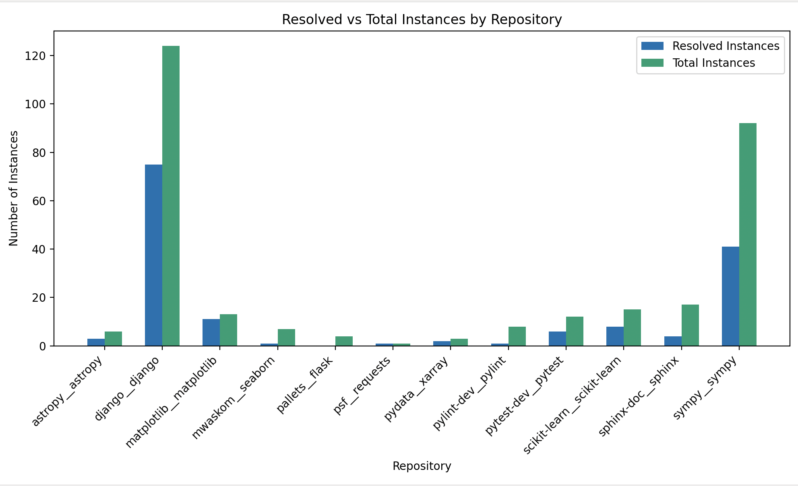

# mini-SWT-agent

mini-SWT-agent is an extension of mini-SWE-agent, providing bug reproduction capabilities for SWE-Bench instances. 

A multi-stage SWE agent framework for automated fail-to-pass test generation, mini-swt-agent achieves **state-of-the-art** performance on [SWT-Bench](https://github.com/logic-star-ai/swt-bench).

Given a bug report, the system uses two rounds of LLM-driven localization (program files → functions, test files → functions) to extract relevant code context, then feeds that context to a shell-enabled agent that iteratively writes and validates tests against the live codebase in a Docker environment.


## Run Test Generation Locally

Clone the project

```bash
  git clone https://github.com/arvmarandi/mini-swt-agent.git
```

Follow mini-swe-agent's setup guide: https://mini-swe-agent.com/latest/quickstart/

Generate tests

```bash
  mini-extra swebench \                                                                  
  --model [model_provider\model_name] \    
  -o outputs \
  --split test \
  --workers [num_workers]
```
## Results

Generated tests using a Mini-Max M2.7 backbone are included in this repository

| Dataset            | Predictions                                                               |
|--------------------|----------------------------------------------------------------------|
| SWT-bench Lite     | `results/mini-swt-agent-outputs.json`     |

Evalution results:

| Dataset            | Results                                                      |
|--------------------|------------------------------------------------------------------|
| SWT-bench Lite     | `results/swt-bench-results.json`     |


## Acknowledgements

 - [mini-swe-agent](https://github.com/SWE-agent/mini-swe-agent)
 - [MiniMax](https://www.minimax.io/)